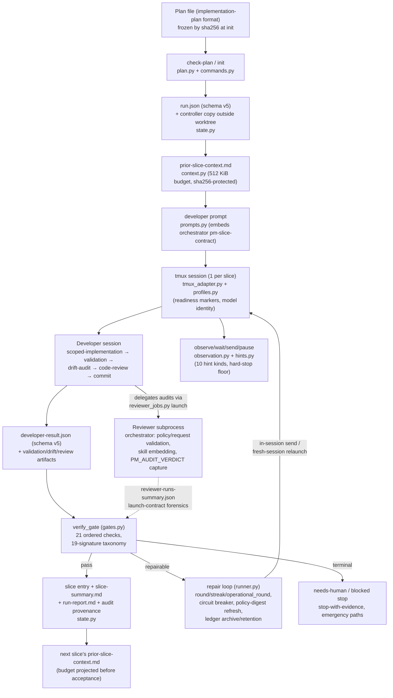

# Mode B Lite — Current-State Map

**Status:** Stage-1 design report. Read-only analysis of the shipped Mode B (Project Manager) system as of branch `main` (commit `7a3ed6e`).
**Role in the report set:** the evidence base for the [replacement ledger](replacement-ledger.md) and the [target design](target-design.md). The [vision assessment](vision-assessment.md) §1 holds the operational-history evidence; this document holds the architectural inventory and classification.

Measured sizes below were collected mechanically from the working tree (subagent-verified, spot-checked). Where a judgement is stated (cost ratings, classifications), it is labelled as judgement.

---

## 1. System at a glance

Mode B is one skill (`skills/project-manager/`) plus load-bearing dependencies in one other skill (`skills/orchestrator/`), a plan contract owned by `skills/implementation-plan/`, audit vocabulary owned by `skills/drift-audit/` and `skills/code-review/`, and CI.

| Layer | Size (measured) |
|---|---|
| PM implementation (`pm.py` + `pm_lib/`, 20 files) | 8,406 LOC |
| Orchestrator scripts consumed by PM (`reviewer_contract.py`, `reviewer_jobs.py`, `reviewer_sessions.py`) | 2,540 LOC |
| PM tests (7 modules + shared helpers) | 8,219 LOC, 306 test functions |
| Orchestrator tests | 670 LOC, 30 test functions |
| PM documentation (`SKILL.md` 214 + `README.md` 547 + `AGENTS.md` 45 + three references 841) | 1,647 lines |
| CLI commands | 19 |
| Run statuses / slice statuses / supervision modes | 10 / 7 / 2 |
| Failure signatures | 19 (15 repairable + 4 terminal) |
| Distinct artifact types per run+slice | ≈35 filenames/families |
| Harness profiles | 4 developer + 1 reviewer-only |
| Developer-prompt template | ≈118 lines before slice content; embeds a further 43-line delegation contract |
| Schema-validated JSON shapes | run.json (17 top-level fields, closed at every level), developer-result.json (13 fields), reviewer-policy.json (14 fields), reviewer-request.json (13 fields), plus manifests/status files |

### 1.1 The slice lifecycle (how the pieces actually connect)

Two drive paths execute this identical loop: the **batch driver** (`run-next`, `run --scope remaining` — in-process, fixed no-judgement policy, fail-closed) and the **model-supervised path** (`start-slice`/`observe`/`wait`/`send`/`pause-until`/`finalize-slice`/`stop-with-evidence` — the same loop spread across CLI invocations with a supervising model choosing operational actions). Both funnel into the same `verify_gate` and the same repair resolver.

### 1.2 Where the system's mass sits

Judgement, from reading every module: roughly one quarter of the implementation is the practical spine (launch a session, capture evidence, recompute authorization/ancestry/cleanliness, persist state, report). The remaining three quarters exist to *avoid trusting model judgement anywhere*: closed-schema validation of every shape, the verdict-relay economy, reviewer-launch forensics, the signature taxonomy and its circuit breaker, ledger archival/retention, digest binding, and the dual controller-state copies — plus the tests that pin all of it.

---

## 2. Component inventory

Format per component: **Purpose / Files / Inputs→Outputs / Callers & dependencies / Risk controlled / Same risk elsewhere? / Still relevant under the proposed vision? / Costs (runtime, cognitive, maintenance, token, operational — judgement, H/M/L) / If removed / If weakened/merged/delegated to PM judgement / Classification.**

Classification vocabulary (from the brief): Critical practical spine · High-value support · Risk-dependent · Duplicated control · Mechanised judgement · Weak-model compensation · Ceremonial overhead · Operational infrastructure · Legacy/compatibility baggage · Complexity compensation · Unclear.

### C1. Plan contract & parser

- **Purpose:** parse implementation-plan markdown into frozen slice contracts; validate the whole plan up front (`check-plan`, auto-run at `init`); freeze the plan by sha256; select the next eligible slice; enforce approval flags.
- **Files:** `pm_lib/plan.py` (348), parts of `commands.py::init_run/check_plan`; the authoring-side contract in `skills/implementation-plan/SKILL.md` ("Machine-Consumed Fields").
- **Inputs→Outputs:** plan file → `PlanSlice` objects (7 required sections, authorized file list, approval flag, `Independent audit required` flag), lint errors/warnings.
- **Callers:** every command that selects or verifies a slice; `git_ops.unauthorized_files` consumes `authorized_files`.
- **Risk controlled:** running against a malformed/ambiguous contract; discovering a plan defect twenty minutes into a run; mid-run plan edits silently changing authorization (digest); duplicate slice ids corrupting completion tracking.
- **Elsewhere:** no — this is the single authorization source.
- **Relevant under proposed vision:** yes, fully. Frozen contracts are retained.
- **Costs:** runtime L, cognitive M (segment-aware glob semantics need learning), maintenance M (parser ↔ implementation-plan format coupling), token L, operational L.
- **If removed:** no mechanical authorization is possible at all — the floor collapses.
- **If weakened/merged:** the fail-closed strictness on *approval flags* and *usable paths* is load-bearing; the seven-required-sections strictness and some lint classes could be tolerance-based without losing the floor. Delegating parsing itself to PM judgement would make the authorized surface a matter of interpretation — rejected.
- **Classification:** **Critical practical spine** (parser, digest freeze, approval flags, eligibility) with **High-value support** (check-plan lint).

### C2. Run state & schema-v5 validation

- **Purpose:** durable `run.json` (17 closed top-level fields), full-shape validation rejecting unknown fields at every level, atomic writes, per-write regeneration of `run-report.md`, operational-events JSONL with a locked counter sidecar.
- **Files:** `pm_lib/state.py` (1,132), `references/run-state-schema.md` (543).
- **Risk controlled:** (a) losing run continuity across interruptions — spine; (b) acting on corrupted/stale/ambiguous state — spine; (c) *any* field drifting from the documented shape, including Developer-reported evidence fields validated on every entry — this last is the expensive part.
- **Elsewhere:** the Developer-evidence shapes are also validated in `gates.py` (duplicated validation, see §3).
- **Relevant:** durable state yes; closed-schema rejection of unknown fields at every level is a weak-model/anti-tamper posture the proposed vision drops (tamper protection comes from state living outside the worktree — see target design).
- **Costs:** runtime L, cognitive **H** (the schema reference alone is 543 lines), maintenance **H** (every state-shape change touches state.py + schema doc + tests; schema v5 has no migration, so shape changes strand runs), token M (schema text reaches prompts/docs), operational M (schema-version bumps invalidate in-flight runs).
- **If removed entirely:** interruption recovery and audit trail lost — unacceptable.
- **If weakened:** validating only the fields PM itself reads (status, ids, heads, budgets) loses nothing practical; malformed narrative fields were already normalised-then-persisted (`slice_entry_from_gate`) rather than trusted.
- **Classification:** durable state + atomic writes + event log: **Critical practical spine**. Closed-field full-shape validation: **Mechanised judgement** + **Weak-model compensation**. The no-migration schema-v5 policy: **Operational infrastructure** with a real operator cost.

### C3. Controller-state duplication (worktree mirror + outside-worktree copy)

- **Purpose:** detect and survive a Developer editing `.ai-pm/.../run.json` (observed once: Test 7). Normal reads require mirror ↔ controller-copy equality; `stop-with-evidence` recovers from the controller copy; emergency-stop path survives both copies unreadable.
- **Files:** `state.py::controller_state_path/load_run/activate_controller_state`, `commands.py::stop_with_evidence/_emergency_halt_without_state`.
- **Risk controlled:** run-record integrity against in-worktree tampering by the supervised agent.
- **Elsewhere:** partially — git evidence would still expose a tampered *outcome* (ancestry/cleanliness recomputed), but not a tampered *record*.
- **Relevant:** the risk is real (observed), but the mechanism is a workaround for a self-inflicted placement decision: state lives inside the worktree the untrusted agent edits, so a second copy plus equality checking was bolted on. Placing authoritative state outside the worktree from the start collapses the whole apparatus to nothing.
- **Costs:** runtime L, cognitive H (mirror-vs-authority semantics, tampered-mirror archival, emergency paths), maintenance M, operational M (mismatch fails normal commands closed).
- **If removed (with state still in-worktree):** Test 7-class tampering becomes invisible — unacceptable. **If replaced by outside-worktree-only state:** same protection, near-zero machinery; the in-repo audit trail becomes write-only artifacts that are never re-read for control decisions.
- **Classification:** **Complexity compensation** (compensates for state placement) over a **Critical practical spine** need (trustworthy control state).

### C4. CLI & command layer

- **Purpose:** 19 subcommands over the run lifecycle; launch-flag fail-closed rules (`--allow-profile-command` / `--harness-command` / `--allow-unattended-default` tri-state); launch-config freezing on the first slice with conflict-fail-closed inheritance.
- **Files:** `pm_lib/cli.py` (234), `commands.py` (1,281).
- **Risk controlled:** ambiguous launches (interactive deadlock on approval prompts); mid-run configuration drift (the Test 8/9 silent model-fallback family); operator error.
- **Relevant:** a CLI is retained; 19 commands is roughly double what the retained workflow needs. `reconcile` (120 lines) exists to recover runs the gate machinery itself stopped; `approve` is spine; `archive-sensitive` exists because reviewer credential seeding puts secrets in the artifact tree (itself a consequence of Developer-commissioned reviewers).
- **Costs:** cognitive H (the SKILL.md operating path is 19 numbered behaviours largely about which command is legal when), maintenance M, operational M.
- **If merged:** batch driver (`run-next`/`run --scope remaining`) and the supervised primitives are two drive paths over one loop — the design already admits this ("by construction"); one path can subsume the other.
- **Classification:** core lifecycle commands: **Critical practical spine**. Dual drive paths: **Duplicated control**. `reconcile`: **Complexity compensation**. `archive-sensitive` + credential-seeding: **Complexity compensation** (downstream of Developer-commissioned review). Launch-config freeze/inheritance: **High-value support** (earned by Tests 8/9) with implementation heavier than the need.

### C5. Gate verification (`verify_gate`)

- **Purpose:** the acceptance decision. 21 ordered checks (inventory §3 of the mechanical catalogue): result presence/shape/version/slice-id/status; ledger shapes; **authorized-surface recomputation from git**; reported-vs-actual changed files; validation block + artifact; drift verdict exact-`PASS` + artifact; review verdict exact-`PASS` + artifact; residual-ledger/artifact shape cross-check; ledger retention; opt-in reviewer forensics; commit/dirty-worktree; **HEAD advancement + ancestry**; commit-hash reconciliation.
- **Files:** `pm_lib/gates.py` (1,104), `git_ops.py` (170).
- **Risk controlled:** unauthorized changes (highest-harm — mechanical, recomputed); broken history (mechanical); false success narration (via verdict/artifact shape checks); knowledge loss (ledger checks).
- **Elsewhere:** the semantic halves of drift/review/validation are performed by the Developer/Reviewer models; PM's check is shape+existence (self-documented). So the *semantic* risk is controlled elsewhere already; the gate controls the *relay* of it.
- **Relevant:** the git-evidence checks are the permanent floor. The verdict-relay and ledger checks are the machinery the proposed vision replaces with PM reading artifacts directly.
- **Costs:** runtime L, cognitive **H** (19 signatures × repair semantics), maintenance **H** (1,780 test lines pin it), token M (repair stanzas per signature), operational **H** — this layer produced all four 0/5 runs (vision assessment §1.1).
- **If removed:** nothing checks anything — unacceptable. **If split:** floor (≈300 LOC: surface, ancestry, cleanliness, commit, result-presence) retains ~all of the catastrophic-failure protection; everything above it is replaceable by PM judgement per the target design.
- **Classification:** git-evidence checks + result presence: **Critical practical spine**. Exact-`PASS` verdict relay, changed-files bookkeeping match, ledger shape/retention/cross-check: **Mechanised judgement** + **Weak-model compensation**, with `ledger-retention` specifically documented as net-negative in live runs (Tests 14/16/18). Commit-hash reconciliation: **Complexity compensation** (PM already proves HEAD; the reported hash adds nothing).

### C6. Reviewer-evidence forensics & audit provenance

- **Purpose:** for `Independent audit required: yes` slices, mechanically verify that every configured reviewer tool launched under the exact frozen policy (digest, slice/plan identity, model/effort, role/access constants, repo/cwd, positive pid, on-disk out/err files, completed/returncode-0) with two separately-contracted audits each ending in a helper-recorded `PM_AUDIT_VERDICT: PASS`; derive per-audit `audit_provenance` (`reviewer` / `developer-self-audit` / `not-observed`) for every terminal entry.
- **Files:** `gates.py:184-617` (~430 LOC), plus the producing side: `orchestrator/scripts/reviewer_contract.py` (584), `reviewer_jobs.py` (1,282), `reviewer_sessions.py` (674); policy-digest binding fields (`before_head`, `session_generation`, `repair_round`, `operational_round`) threaded through `runtime.py`/`runner.py`/`state.py`.
- **Risk controlled:** a Developer faking independent review (raw command, hand-written manifest, stale evidence from a pre-repair tree, mixed/mislabelled audits, wrong model).
- **Elsewhere:** the same risk is *also* addressed by prompt prohibitions, and self-admittedly not fully addressed here either ("raises the cost of casual forgery, not proof that a matching process ran").
- **Relevant under proposed vision:** **no, structurally.** The entire apparatus exists because the *Developer* commissions its own audit and PM must forensically reconstruct whether that really happened. When PM commissions the review itself (target design), the question "did an independent review run?" is answered by PM's own action log, and every one of these checks — digest binding, `operational_round`, `reserved_skill_sets`, sentinel extraction, pid/outfile existence, provenance derivation — becomes moot.
- **Costs:** runtime M, cognitive **H** (the single longest paragraph in the repo documents this gate), maintenance **H** (digest-binding bug class produced Tests 17/18 and the two most recent fix commits on `main`), token H (the developer prompt spends ~40% of its length on reviewer mechanics), operational **H** (evidence orphaned by digest churn ended two runs).
- **If removed with nothing else changed:** opt-in independence becomes narration — unacceptable. **If the commissioning side moves to PM:** removable wholesale, with *stronger* independence (the observed verdict-shaping channel — Tests 13/14 — closes because the implementer no longer talks to its auditor at all).
- **Classification:** **Mechanised judgement** + **Complexity compensation** (compensates for the Developer-commissions-its-own-auditor topology). The underlying *outcome* (independent eyes on risky slices) is **Risk-dependent spine**.

### C7. Repair loop, signature taxonomy & circuit breaker

- **Purpose:** classify every non-pass into one of 19 signatures; steer repairable ones back into the live session with a per-signature stanza; escalate a repeating signature to one fresh session; stop on the third strike or budget exhaustion; keep separate `round` vs `operational_round` budgets; archive per-round results; re-verify the identical gate each time.
- **Files:** `runner.py` (1,445 — `resolve_repair_action`, `finalize_model_supervised_slice`, `handle_idle_stall`, `_relaunch_fresh_session`, `_fresh_session_repair_prompt`), `prompts.py::_repair_stanza` (12 stanzas), repair fields in `state.py`.
- **Risk controlled:** wasting a long slice on a fixable slip (real: Tests 5/7/8 show the missing-artifact repair working); infinite repair loops (breaker); operational stalls consuming defect budget (the `operational_round` split, added four days ago).
- **Elsewhere:** the Developer's own self-correction is the first line; PM repair is second.
- **Relevant:** bounded persistence is retained; the taxonomy is not. The evidence is stark: the taxonomy's newest members (`ledger-retention`, digest-refresh interactions) *caused* the failures the loop then had to manage, and the dual-budget accounting exists to patch interactions among the taxonomy's own members (Test 18: a "substantive" bookkeeping-only signature still orphans evidence — the patch didn't close the class).
- **Costs:** cognitive **H** (round/streak/generation/operational_round semantics fill ~90 lines of schema doc), maintenance **H** (1,961 test lines on supervision/repair alone), operational **H**.
- **If removed entirely:** every first failure hard-stops — wasteful, the pre-repair world.
- **If simplified to attempt-budget + PM judgement:** retains the working behaviours (nudge, relaunch, stop) minus the taxonomy interactions; PM writes the correction message from the actual gap instead of a canned stanza.
- **Classification:** bounded retry + fresh-session escalation + budget: **High-value support**. The 19-signature taxonomy, per-signature stanzas, streak accounting, dual budgets, per-round archives: **Mechanised judgement** + **Complexity compensation** (each new element patches interactions of prior elements).

### C8. Prior-slice context pipeline

- **Purpose:** render a bounded (512 KiB), sha256-protected `prior-slice-context.md` per slice from latest-authoritative accepted outcomes; embed the digest in the prompt; re-verify before finalization (terminal on mismatch); project the *next* slice's context size before accepting this one (`context-budget` repairable).
- **Files:** `pm_lib/context.py` (165), checks in `runner.py`/`gates.py`/`reconcile`.
- **Risk controlled:** fresh sessions losing hard-won knowledge (real — the strongest genuinely-new capability of recent Mode B); context poisoning/tampering; unbounded context growth stranding later slices.
- **Relevant:** the *capability* (carry knowledge forward) is spine. The integrity-digest protection and the pre-acceptance budget projection are proportionate-cost guards worth keeping in simplified form. The downstream ledger machinery it feeds (C9) is not.
- **Costs:** runtime L, cognitive M, maintenance M, token M (context is re-sent every slice), operational L.
- **Classification:** **Critical practical spine** (knowledge carry-forward) with **High-value support** guards (size bound); the sha256 terminal gate is **Risk-dependent** (cheap, keep).

### C9. Structured ledgers (`residual_findings`, `continuation_notes`) & retention machinery

- **Purpose:** closed-vocabulary structured ledgers in every developer result (6 sources × 4 dispositions; 9 note categories; 100-entry/4,000-char caps); shape-gated at verification; archived per repair round; mechanical retention (field-superset equality) across rounds; artifact/ledger cross-check heuristic.
- **Files:** `gates.py` (~250 LOC of validators/retention), `constants.py` vocabularies, `state.py` renderers, repair stanzas, schema docs.
- **Risk controlled:** non-blocking findings vanishing after the run (real — Tests 1, 11, 18 observed real drops); repair rounds silently erasing knowledge.
- **Elsewhere:** the same information also flows through prior-slice context, slice summaries, and the run report — four representations of the same knowledge (§3).
- **Relevant:** the *outcome* (findings and lessons survive to the report) is spine. The *mechanism* is the single best-documented net-negative in the system: verbatim-wording, Unicode-vs-ASCII, and schema-superset traps each independently ended a run (Tests 14/16/18), while the gate also missed a real drop (Test 11, Slice 2 — "coverage looks inconsistent rather than fixed").
- **Costs:** cognitive H, maintenance H, token M, operational **H**.
- **If replaced by PM curation:** PM reads audit artifacts and prior notes, maintains the run's notes/findings itself, and cannot be wedged by wording — it can also *judge* materiality, which the mechanical check explicitly cannot.
- **Classification:** **Mechanised judgement** + **Weak-model compensation**, over a **Critical practical spine** outcome (findings visibility).

### C10. Prompt contracts

- **Purpose:** the ~118-line developer prompt (16 path/config header lines, 11-step workflow, reviewer-helper sequence, evidence templates, artifact list, schema reminders, embedded 43-line delegation contract); the repair template + 12 stanzas; fresh-session recombination.
- **Files:** `prompts.py` (310), `references/developer-prompt.md` (183).
- **Risk controlled:** harnesses without skill loaders still get complete instructions (real, keeps the local-first story working); prompt/renderer drift (editing-note discipline).
- **Relevant:** a rendered per-slice prompt is spine. Its *composition* is dominated by process compliance: by rough count, ≈70% of the template is reviewer mechanics, result-schema compliance, and ledger rules; ≈30% is the actual engineering contract. Under the proposed vision the prompt shrinks to the contract + context + a short result convention.
- **Costs:** token **H** (every slice, every relaunch), cognitive M, maintenance M.
- **Classification:** rendered contract prompt: **Critical practical spine**. The process-compliance bulk: **Mechanised judgement** overhead mirrored from C5/C6/C9.

### C11. Tmux adapter, harness profiles, model identity

- **Purpose:** start/observe/inject/capture/stop tmux sessions; per-tool readiness markers; hard-prompt marker floor (trust/approval/credential/permission/side-effect); profile-composed launch commands (sandbox/network/git-access flags per need); OpenCode inventory-backed model-identity verification; launch-config freeze.
- **Files:** `tmux_adapter.py` (356), `profiles.py` (264), profile tables in `constants.py`.
- **Risk controlled:** typing into the wrong/dead session; prompt-injection into a not-ready TUI (observed as real per-tool timing differences); silent model fallback (incidents in Tests 1/9 motivated the identity checks, whose operation was then confirmed in Tests 5/7/10/12); unattended sessions deadlocked on approval prompts; credential/trust prompts being answered blind.
- **Relevant:** yes — this is irreplaceable operational infrastructure for the chosen execution substrate (interactive CLI harnesses in tmux). Its size is proportionate to genuine per-tool variance, documented from direct observation.
- **Costs:** runtime L, cognitive M, maintenance M (new harness = new profile + fixtures), operational M (marker false-positives are why batch never interrupts waits).
- **If removed:** no execution substrate. **If simplified:** marker sets and readiness heuristics are already minimal for what they do; the main simplification available is fewer *consumers* (one drive path, fewer capture variants).
- **Classification:** **Operational infrastructure** (spine-adjacent); model-identity verification: **High-value support**; hard-prompt floor: **Critical practical spine** (it is the only thing standing between unattended automation and credential prompts).

### C12. Observation & operational hints

- **Purpose:** compact evidence for the supervising model (`observe`/`wait`), append-only observation events with a 60-second floor, live-pane preservation, 10 hint kinds + 5 usage-limit subtypes with confidence/reset parsing, hard-stop refusal floor on `send`/`pause-until`/retry, idle-stall detection (3 windows / 600 s).
- **Files:** `observation.py` (363), `hints.py` (362).
- **Risk controlled:** unattended continuation into billing/auth/permission prompts (floor — keep); misreading slow local-model prefill as a stall (real, documented); multi-hour pauses flooding logs.
- **Relevant:** yes in reduced form. Hint *extraction* beyond the hard-stop floor is advisory input to a model that can read the pane text itself; the taxonomy's precision (confidence fields, subtype lattice, reset-time parsing rules) serves the deterministic-batch path that the target design removes.
- **Costs:** cognitive M, maintenance M (marker regexes vs real CLI wording — documented coverage gaps), operational L.
- **Classification:** hard-stop floor: **Critical practical spine**. Structured hint taxonomy: **High-value support** shading into **Mechanised judgement** at its precise edges (reset parsing, confidence grades) — built for the unattended path.

### C13. Artifact capture & reporting

- **Purpose:** ~35 artifact types per run+slice (per-attempt, per-round, live-latest, timeout, stop, repair-refused pane captures; git status ×3 stages + per-round; diff; transcripts; summaries; reports); `run-report.md` regenerated on every state write; `slice-summary.md` per terminal entry; grouped superseded-vs-authoritative outcomes.
- **Files:** `runtime.py` (460), capture paths through `runner.py`/`commands.py`/`observation.py`, renderers in `state.py`.
- **Risk controlled:** un-debuggable failures (Test 4: missing stdout capture made a launch bug hard to diagnose — capture earns its keep); un-auditable acceptance; post-run review burden.
- **Relevant:** yes — evidence is spine. The *variant explosion* (six pane-capture families) tracks the repair loop's round structure; collapse the rounds and the variants collapse.
- **Costs:** runtime L, cognitive M (knowing which artifact answers which question), maintenance M, operational L.
- **Classification:** core evidence set (prompt, diff, statuses, captures, result, summary, report): **Critical practical spine**. Per-round/per-variant families: **Complexity compensation** (downstream of C7).

### C14. Idle-stall & transient-retry machinery

- **Purpose:** auto-nudge a genuinely idle session (3 windows/600 s, byte-identical pane), escalate through the same signature machinery; reclassify a high-confidence transient `blocked` into a bounded retry.
- **Files:** `runner.py::handle_idle_stall/reclassify_high_confidence_transient_stop`, `observation.py::idle_stall_due`.
- **Risk controlled:** a 35-minute unnoticed stall (Test 1 — real); honest `blocked` self-reports getting zero retry while `repairable` got three (Test 1 — real inconsistency this fixed).
- **Relevant:** the *behaviour* (nudge idle sessions, retry clear transients) is exactly what a supervising model does naturally; the machinery encodes it deterministically for the unattended path and then needs `operational_round` accounting to stop it perturbing the defect budget and the policy digest (Tests 17/18). Under one supervised path, this reduces to PM judgement plus the hard-stop floor.
- **Costs:** cognitive H (the `operational_round` paragraph is among the densest in the schema doc), maintenance M, operational M.
- **Classification:** **Weak-model compensation** / **Duplicated control** (duplicates supervising-model judgement mechanically) — while noting Tests 16/17/18 show the *stall pattern itself* (completed reviewer artifact sitting unpolled) is real and needs *some* handler.

### C15. Orchestrator reviewer launcher (as a standalone skill)

- **Purpose:** validated read-only Reviewer launches for any Developer (Mode A or B): schema-v2 policy/request, skill-bundle embedding, per-tool command composition, lifecycle (`init/launch/activity/wait/extract/cancel`), evidence files, PID-reuse-safe cancellation.
- **Files:** `skills/orchestrator/` (2,540 script LOC + docs + 670 test LOC).
- **Risk controlled:** ad-hoc raw reviewer commands with no evidence; reviewers mutating the workspace; missing skill instructions on harnesses without loaders.
- **Relevant:** as a *standalone Rung-0/1 skill*, yes — outside this redesign's scope except where PM depends on it. As **PM's trust dependency**, no (C6). The PM-specific parts (policy binding fields, `reserved_skill_sets`, `PM_AUDIT_VERDICT` sentinel, `pm-slice-contract.md`) exist solely to serve C6.
- **Classification:** standalone: out of scope (retained skill). PM-facing surface: **Complexity compensation** for the Developer-commissions topology.

### C16. Tests & CI

- **Purpose:** 306 PM + 30 orchestrator test functions (8,889 LOC); CI compiles and runs all with tmux and fake harnesses.
- **Relevant:** the *approach* (fake harnesses via `--harness-command`, recorded pane fixtures, no real CLIs in CI) is a genuinely good pattern to carry forward. The *volume* pins the machinery being replaced: by module, the largest suites (gates 1,780; supervision/repair 1,961; plan/state 1,063) map 1:1 onto C5/C7/C2.
- **Classification:** test *infrastructure/patterns*: **High-value support**. Test *mass*: follows the fate of what it pins (not evidence of value — per the brief, coverage ≠ importance).

### C17. Documentation set

- **Purpose/size:** SKILL.md 214 + README 547 + AGENTS 45 + references 841 = 1,647 lines of PM-facing documentation; plus cross-references from root README, VISION, CONTRIBUTING, implementation-plan, handoff, report skills.
- **Relevant:** honesty and structure are exemplary; volume tracks mechanism count. The documentation repeatedly documents *the same contracts* at different altitudes (§3).
- **Classification:** **High-value support** in style; volume is **Complexity compensation**.

---

## 3. Cross-cutting findings

### 3.1 Duplicated state / validation / representations

1. **Run state exists twice** (worktree mirror + controller copy) with equality checking — C3.
2. **Developer-evidence shapes validated twice** — `gates.py` validators at verification and `state.py` schema validation at persistence (with a normalise-on-persist step so recording a malformed failure can't wedge the run — machinery to make one validator survive the other).
3. **The same knowledge has four representations:** `developer-result.json` ledgers → slice entry fields → `slice-summary.md` / `run-report.md` renderings → next slice's `prior-slice-context.md`. Retention machinery (C9) exists to keep representation 1 consistent with itself across rounds while 3 and 4 are re-derived.
4. **Launch configuration exists in three shapes:** CLI flags, `harness.launch_config` (frozen), `current_slice.launch_config` (snapshot), with inheritance/conflict rules between them.
5. **The reviewer contract is stated four times:** `reviewer-contract.md`, `pm-slice-contract.md` (embedded per prompt), the developer-prompt reviewer sequence, and the `reviewer_contract.py` validators — deliberately single-sourced *per audience*, but four artifacts to keep aligned.
6. **The plan's authorized surface is enforced in two places** (parser lint + gate recomputation) — this one is *good* duplication (authoring-time vs acceptance-time) and is kept.

### 3.2 Choke points and cycles

- **`verify_gate` is the choke point by design** — correct and kept (narrowed) in any redesign.
- **The repair loop ↔ reviewer-policy digest cycle:** repairs refresh the digest; the digest invalidates evidence; invalidated evidence fails the gate; the failure is a repair. Tests 17/18 traversed this cycle to budget exhaustion. This is the clearest *architectural* (not implementation) defect in the current system: two well-intentioned mechanisms compose into a loop.
- **The schema-v5 no-migration policy × in-flight runs:** any shape change strands active runs (operator re-inits with `--assume-complete` — a command that exists to recover from the schema policy).

### 3.3 Prompt-enforced vs mechanically-enforced boundaries (honesty check)

Mechanical: file surface, ancestry, cleanliness, plan digest, approval flags, hard-prompt refusal floor, context digest, size budgets, schema shapes, reviewer-launch consistency. Prompt/heuristic: everything semantic — dependency/license/side-effect stops (pane markers), read-only reviewer discipline on most harnesses, validation actually testing what it claims, review substance. The current docs state this honestly; the map confirms it: **the mechanical layer was never checking semantics — it was checking envelopes.**

### 3.4 Machinery that exists to prove compliance to other machinery

Self-contained list (each item's *only* consumer is another control): `reviewer-policy` digest binding fields (consumed by C6), `operational_round` (added so digest refresh isn't a no-op — consumed by C6), `reserved_skill_sets` (pre-launch mirror of a finalize-time check), `changed_files` reported-vs-actual match (PM already computes the true set; the report adds only a bookkeeping-failure mode), commit-hash relay + reconciliation artifacts (PM already proves HEAD), `audit_provenance` derivation (labels for the report; Test 18 shows the labels can mislead), per-round result archives (consumed by retention checking and fresh-session prompt recombination).

---

## 4. Classification summary

| Classification | Components (by section) |
|---|---|
| **Critical practical spine** | C1 (parser/digest/approval/eligibility), C2 (durable state, atomic writes, event log), C5 (git-evidence floor + result presence), C8 (knowledge carry-forward), C10 (rendered contract prompt), C11 (hard-prompt floor; session control), C12 (hard-stop refusal floor), C13 (core evidence set) |
| **High-value support** | C1 (plan lint), C4 (launch-config freeze — outcome, not mechanism), C7 (bounded retry/escalation/budget), C8 (size bound), C11 (model-identity verification), C12 (hint extraction as advisory), C16 (fake-harness test pattern) |
| **Risk-dependent** | independent review as an outcome (C6's goal), C8 context-digest gate, deep artifact capture |
| **Duplicated control** | C4 dual drive paths, C14 (mechanical re-encoding of supervising-model judgement), §3.1 items 1–5 |
| **Mechanised judgement** | C5 verdict-relay/ledger checks, C6 forensics, C7 taxonomy/stanzas, C9 ledgers+retention, C2 closed-field validation, C12 precise hint edges |
| **Weak-model compensation** | C9, C14, closed vocabularies, verbatim retention, schema rigour on developer output |
| **Ceremonial overhead** | `audit_provenance` labels beyond a summary line; commit-hash relay; reported-changed-files match |
| **Operational infrastructure** | C11, C13 capture mechanics, schema-versioning policy |
| **Legacy/compatibility baggage** | terminology residue (`master-controller`/MC in test-fixture history), `.pytest_cache`/`__pycache__` committed artifacts, `pm-test/` fixture coupling; otherwise notably little — the repo prunes aggressively |
| **Complexity compensation** | C3 (for state placement), C6 (for review topology), C7 taxonomy interactions (dual budgets, per-round archives), C13 variant explosion, `reconcile`, `archive-sensitive`, `--assume-complete` (for the no-migration policy) |
| **Unclear** | none material — the system is unusually well self-documented; every mechanism's intent was recoverable |

The headline of the map: **the spine is small, real, and proven; the majority of the system's mass is machinery for not trusting model judgement, and that machinery — not the spine — is where the live failures now come from.** The target design keeps the spine essentially verbatim, keeps the operational infrastructure it runs on, and replaces the mechanised-judgement mass with an accountable PM.
